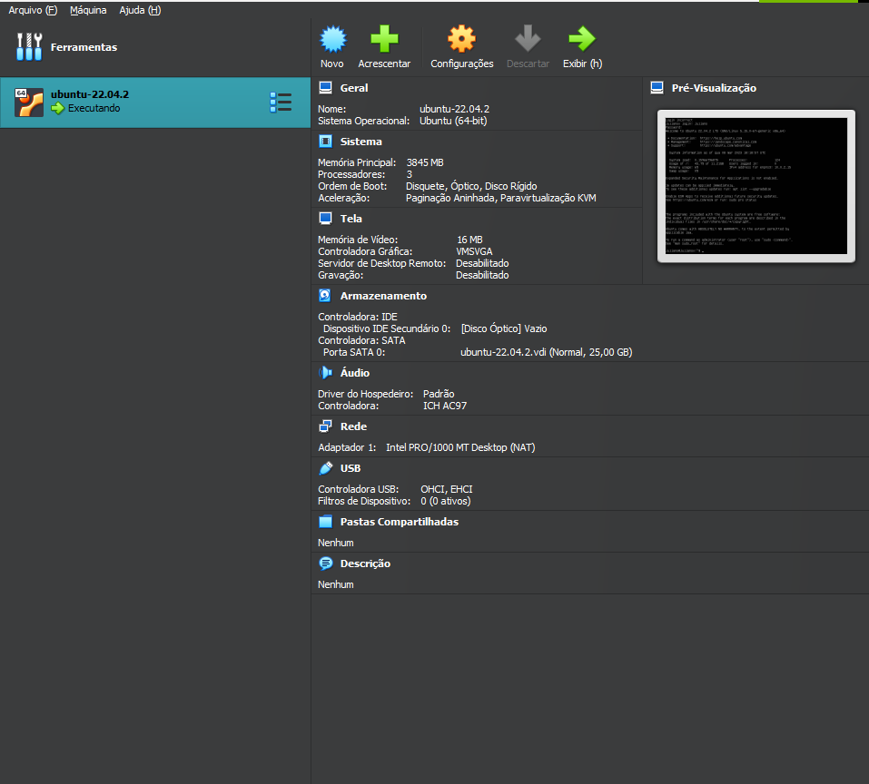
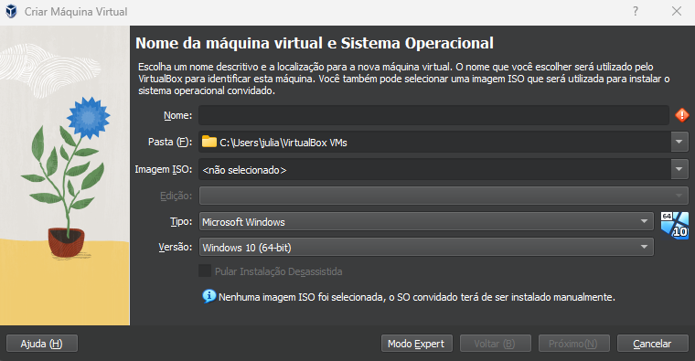
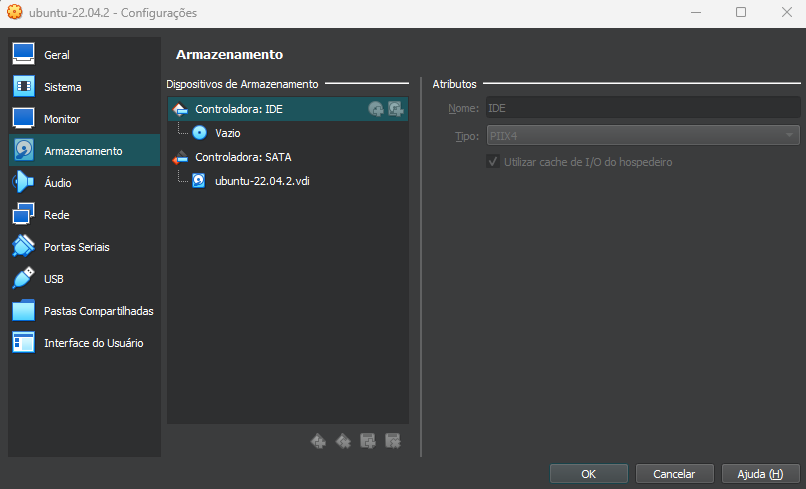
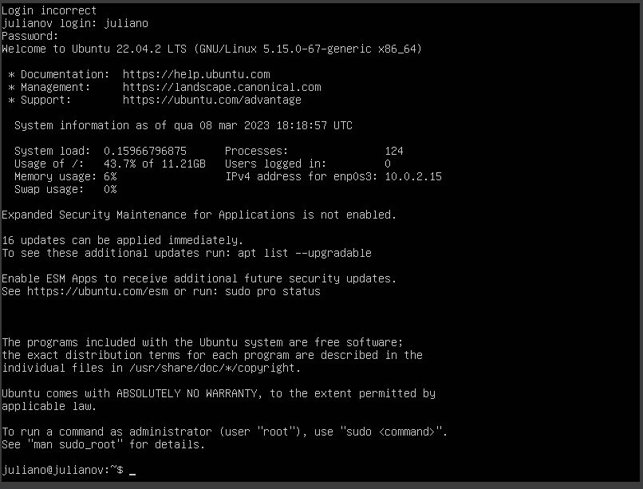
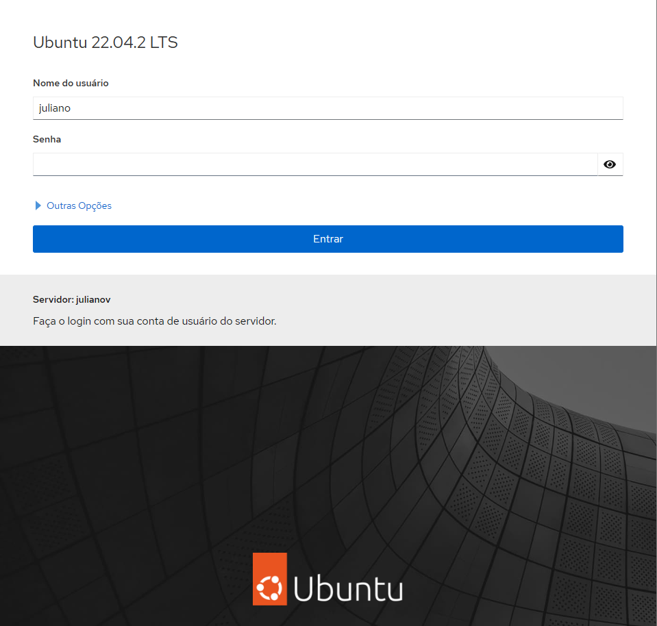

<h1 align="center"> instalação do virtualbox </h1>

## Descrição

Baixe o software de virtualização de sua preferência,
 
como o VirtualBox https://www.virtualbox.org/

ou VMWare https://www.vmware.com/

<h1 align="center"> instalação da ISO do Ubuntu Server </h1>

Baixe a imagem ISO do Ubuntu Server no site oficial da Ubuntu (https://ubuntu.com/download/server).

* Abra o software de virtualização e crie uma nova máquina virtual.

* Na criação da máquina virtual, escolha o sistema operacional Ubuntu Server e configure a quantidade de memória RAM e espaço em disco que deseja alocar para a máquina virtual.

* Na configuração de armazenamento, adicione a imagem ISO do Ubuntu Server como um dispositivo de inicialização.

* Inicie a máquina virtual e siga as instruções na tela para instalar o Ubuntu Server normalmente, como se estivesse instalando em um computador físico.

* Após a instalação, inicie a máquina virtual e comece a usar o Ubuntu Server normalmente.

<h2 align="center"> instalação Finalizada </h2>

----

<h1 align="center"> instalação do ubuntu server </h1>

Insira o DVD ou pendrive bootável no computador que deseja instalar o Ubuntu Server.

Reinicie o computador e entre na BIOS para configurar a ordem de inicialização do sistema. Certifique-se de que o CD ou USB seja a primeira opção de inicialização.

Quando o computador inicializar, escolha a opção "Install Ubuntu Server" no menu inicial.

Escolha o idioma desejado para a instalação.

Selecione as opções de teclado e localização do fuso horário.

Escolha o tipo de instalação que deseja realizar. Você pode optar por instalar o sistema operacional inteiro em um único disco ou particionar o disco rígido para armazenar dados separadamente do sistema operacional.

----

Configure as informações do usuário e a senha de root.

Aguarde até que a instalação seja concluída. Durante esse processo, você pode optar por instalar atualizações durante a instalação.

Reinicie o computador e remova o DVD ou pendrive bootável.

Inicie o Ubuntu Server e comece a usá-lo normalmente.

---

<h2 align="center"> instalação Finalizada </h2>

---

<h2 align="center"> instalação cockpit </h2>

* ### Faça login na sua instância do Ubuntu Server e emita o comando:

><pre><code>sudo apt-get install cockpit -y</pre></code>

* ### Quando a instalação for concluída, inicie e ative o Cockpit com:

><pre><code>sudo systemctl enable --now cockpit.socket</pre></code>

* ### Agora que o Cockpit está funcionando, você pode fazer o login. No entanto, dependendo de como o seu sistema está configurado, você deve certificar-se de que o usuário com o qual você fez login no Cockpit tenha privilégios sudo. Para fazer isso, digite o comando:

><pre><code>sudo usermod -aG sudo USER</pre></code>

Onde está o nome do usuário em questão.USER

---

* ### Apenas por diversão, adicionaremos suporte a contêineres à nossa instância apenas para mostrar como é fácil. Na janela do terminal, emita o comando:

><pre><code>sudo apt-get install podman cockpit-podman -y</pre></code>

Abra um navegador da web e digite o endereço IP do servidor Ubuntu seguido de ":9090" na barra de endereços. Por exemplo, se o endereço IP do seu servidor Ubuntu for "192.168.1.100", digite "https://192.168.1.100:9090"

<h2 align="center"> instalação Finalizada </h2>

---

<h2 align="center"> instalação do Docker </h2>

## descrição

* O Docker é uma plataforma de software que permite que desenvolvedores e administradores de sistemas criem, implantem e gerenciem aplicativos em contêineres. Os contêineres são uma forma de virtualização leve que oferecem isolamento de recursos, permitindo que as aplicações sejam executadas de forma consistente em diferentes ambientes. O Docker simplifica a criação, distribuição e execução de aplicativos, permitindo que as equipes de desenvolvimento e operações trabalhem juntas de forma mais eficiente e eficaz. Ele é amplamente utilizado em ambientes de desenvolvimento e produção, permitindo a implantação rápida de aplicativos e o gerenciamento eficiente de infraestrutura.
---

## instalação

O pacote de instalação do Docker disponível no repositório oficial do Ubuntu pode não ser a versão mais recente. Para garantir que temos a versão mais recente, instalaremos o Docker do repositório oficial do Docker. Para fazer isso, adicionamos uma nova fonte de pacote, adicionamos uma chave Docker GPG para garantir a validade dos arquivos baixados e, em seguida, instalamos o pacote.

* Primeiro, atualize sua lista existente de pacotes:
><pre><code>sudo apt update</pre></code>

* Em seguida, instale alguns pacotes pré-requisito que deixam o apt usar pacotes pelo HTTPS:

><pre><code>sudo apt install apt-transport-https ca-certificates curl software-properties-common</pre></code>

* Então, adicione a chave GPG para o repositório oficial do Docker no seu sistema:

><pre><code>curl -fsSL https://download.docker.com/linux/ubuntu/gpg | sudo apt-key add -</pre></code>

* Adicione o repositório do Docker às fontes do APT:

><pre><code>sudo add-apt-repository "deb [arch=amd64] https://download.docker.com/linux/ubuntu focal stable"</pre></code>

* Em seguida, atualize o banco de dados do pacote com os pacotes do Docker do recém adicionado repositório:

><pre><code>sudo apt update</pre></code>

* Certifique-se de que você está prestes a instalar do repositório do Docker ao invés do repositório padrão do Ubuntu:

><pre><code>apt-cache policy docker-ce</pre></code>

* Finalmente, instale o Docker:

><pre><code>sudo apt install docker-ce</pre></code>

* O Docker deve agora ser instalado, o daemon iniciado e o processo habilitado a iniciar no boot. Verifique se ele está funcionando:

><pre><code>sudo systemctl status docker</pre></code>

* mostrando que o serviço está ativo e funcionando

### Instalando o Docker agora não dá apenas o serviço do Docker (daemon), mas também o utilitário de linha de comando docker, ou o cliente do Docker. Vamos explorar como usar o comando docker mais tarde neste tutorial.

---
## Passo 2 — Executando o Comando Sem Sudo [Opcional]

### descrição

Por padrão, o comando docker só pode ser executado pelo usuário root ou por um usuário no grupo docker, que é criado automaticamente no processo de instalação do Docker. Se você tentar executar o comando docker sem prefixar ele com o sudo ou sem estar no grupo docker, você terá um resultado como este:

---

* Se você quiser evitar digitar sudo sempre que você executar o comando docker, adicione seu nome de usuário no grupo docker:

><pre><code>sudo usermod -aG docker ${USER}</pre></code>

* Para inscrever o novo membro ao grupo, saia do servidor e logue novamente, ou digite o seguinte:

><pre><code>su - ${USER}</pre></code>

Você será solicitado a digitar a senha do seu usuário para continuar.

Confirme que seu usuário agora está adicionado ao grupo docker digitando:

><pre><code>id -nG</pre></code>

* Se você precisar adicionar um usuário ao grupo docker com o qual você não está logado, declare esse nome de usuário explicitamente usando:

><pre><code>sudo usermod -aG docker username</pre></code>

sudo curl -L "https://github.com/docker/compose/releases/download/1.26.0/docker-compose-$(uname -s)-$(uname -m)" -o /usr/local/bin/docker-compose

<h2 align="center"> instalação Finalizada </h2>

---
<h2 align="center"> instalação Finalizada </h2>

